# ArmSense

1. [Abstract](#abstract)
2. [Introduction](#introduction)
3. [Design](#design)
    1. [Reading EMG](#reading-emg)
    2. [Processing EMG](#processing-emg)
    3. [Using EMG](#using-emg)
    4. [Combining Everthing](#combining-everything)
4. [Implementation](#implementation)
    1. [Circuit Simulation](#circuit-simulation)
    2. [PCB's](#pcbs)
    3. [CAD Modeling](#cad-modeling)
5. [Results](#results)
    1. [Cost](#cost)
    2. [Time](#time)
6. [Conclusion](#conclusion)

## Abstract
The ArmSense project explores the development of a cost-effective sEMG-based arm band for rehabilitation robotics, designed to assist individuals in restoring the functionality of their limbs. By capturing and processing forearm muscle activity, the device aims produce control signals to replicate human hand movements, offering an affordable alternative to existing products like the Myo ArmBand.

## Introduction
Inspired by my research at the [Human Engineering Research Laboratories (HERL)](https://www.herl.pitt.edu/), this project focuses on creating an affordable arm band that reads forearm muscle signals. Unlike the expensive Myo ArmBand, ArmSense aims to provide a cost-effective solution with similar functionalities. 

## Design

### Reading EMG
The design uses a bipolar electrode configuration to measure the potential difference between two electrodes placed on the same muscle, with a ground electrode on a non-muscular region.

    
    <figure>
        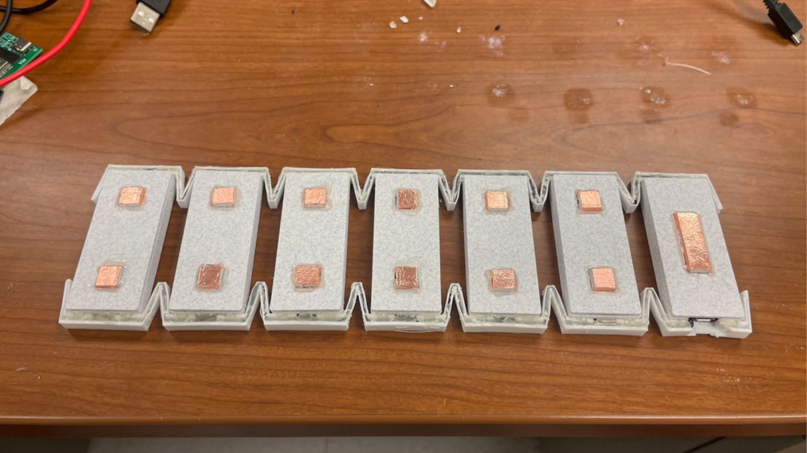
        
Bipolar Electrode Configuration

    </figure>

### Processing EMG
The EMG signal is processed through a series of steps:
1. Difference Amplifier: Suppresses noise in the signal.
2. High-Pass Filter: Eliminates low-frequency noise.
3. Full-Wave Rectifier: Stabilizes and smooths the signal.
4. Low-Pass Filter: Removes high-frequency noise.

These stages ensure the signal is clean and suitable for further processing.

    
    <figure>
        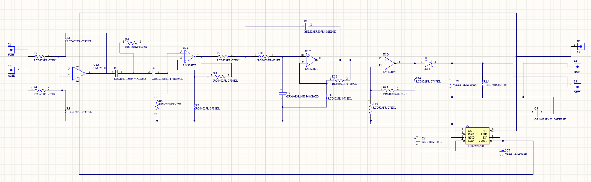
        
EMG Module Schematic

    </figure>

### Using EMG
The processed EMG signals are read by an esp32 microcontroller via analog pins, allowing communication with other hardware. For this project, the esp32 transmits data to a laptop via Bluetooth, which is then displayed using a Python script.

    
    <figure>
        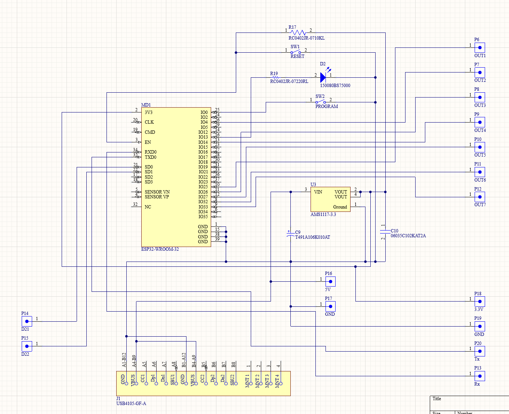
        
Controller Module Schematic

    </figure>

### Combining Everything
The arm band uses 6 channels of electrodes in a bipolar configuration, targeting different muscle regions around the forearm. A reference electrode is placed on a bony part of the forearm. The modules, housed in a 3D-printed PLA case, are connected using a flexible TPU band.

    
    <figure>
        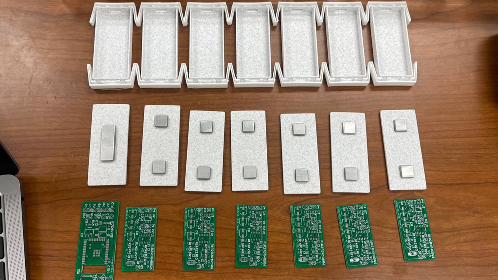
        
Components Combined Exploded

    </figure>

    
    <figure>
        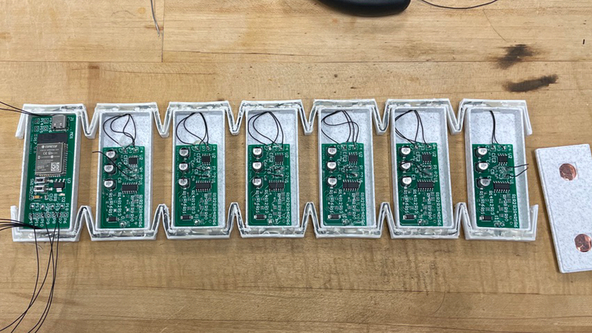
        
Components Combined

    </figure>

## Implementation

### Circuit Simulation
Due to the specificity of components like the voltage inverter and precision quad op-amps, circuit simulation was challenging. Validation relied on similar online tests, leading to successful PCB creation.

### PCB's
The initial PCB design had to be downsized to fit within the module housing, resulting in a reduction from seven to six measurement channels.

    
    <figure>
        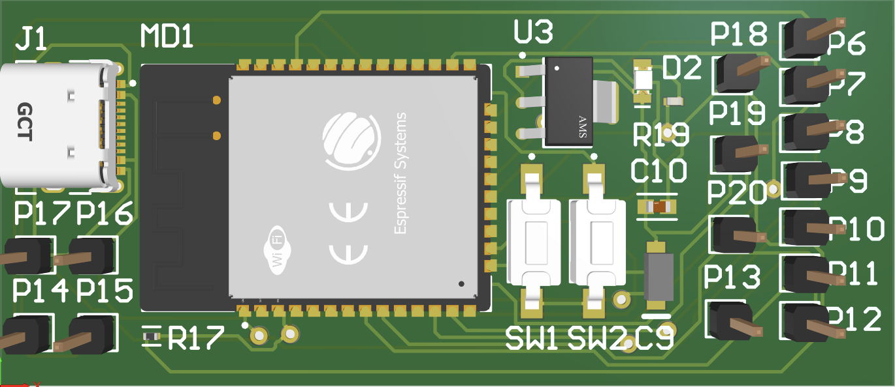
        
Controller Module PCB

    </figure>

    
    <figure>
        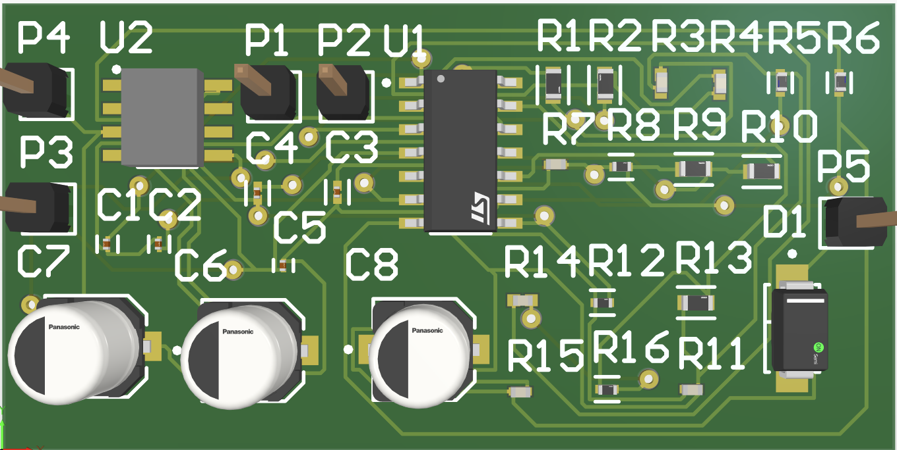
        
EMG Module PCB

    </figure>

### CAD Modeling
Extensive CAD modeling and iterations led to a functional design. Initial cardboard prototypes were scaled up to fit PCBs, with the final design using TPU for flexibility and wire encasement.

    
    <figure>
        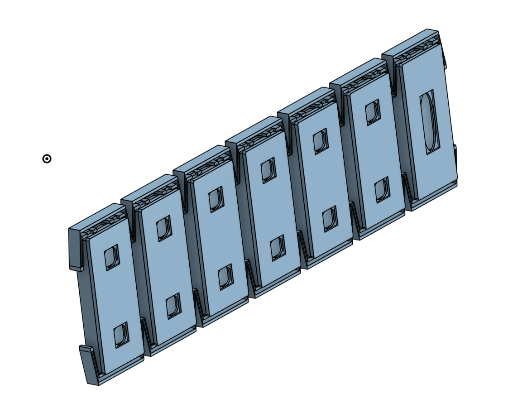
        
Enclosure 3D Model

    </figure>

    
    <figure>
        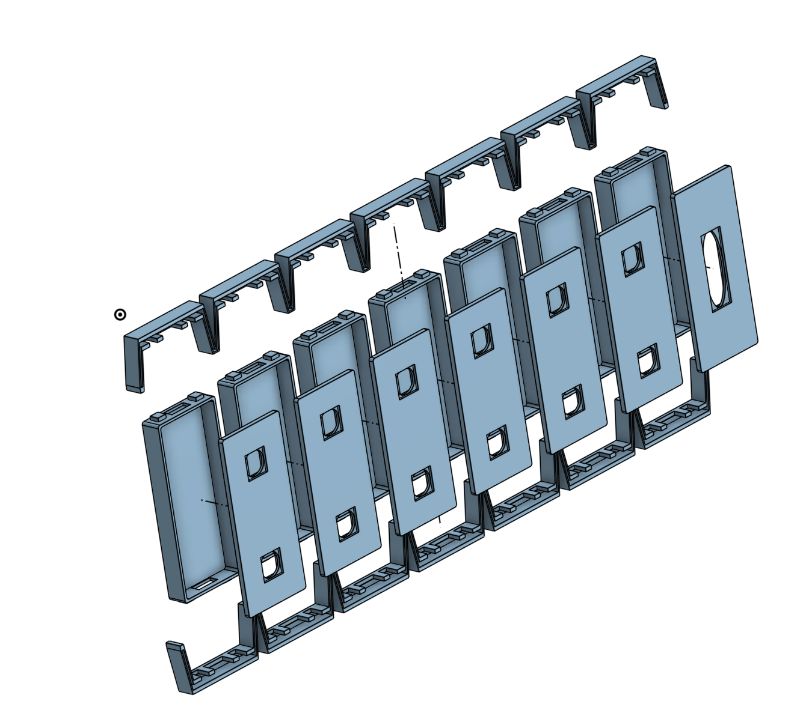
        
Enclosure 3D Model Exploded

    </figure>

## Results
Click the below image to see the demo on YouTube!

Testing was smooth, with successful signal transmission via Bluetooth and robust physical endurance of the TPU band. Minor issues included manual application of solder paste for surface mount PCBs and programming the esp32 chip using parallel connections.

    
    <figure>
        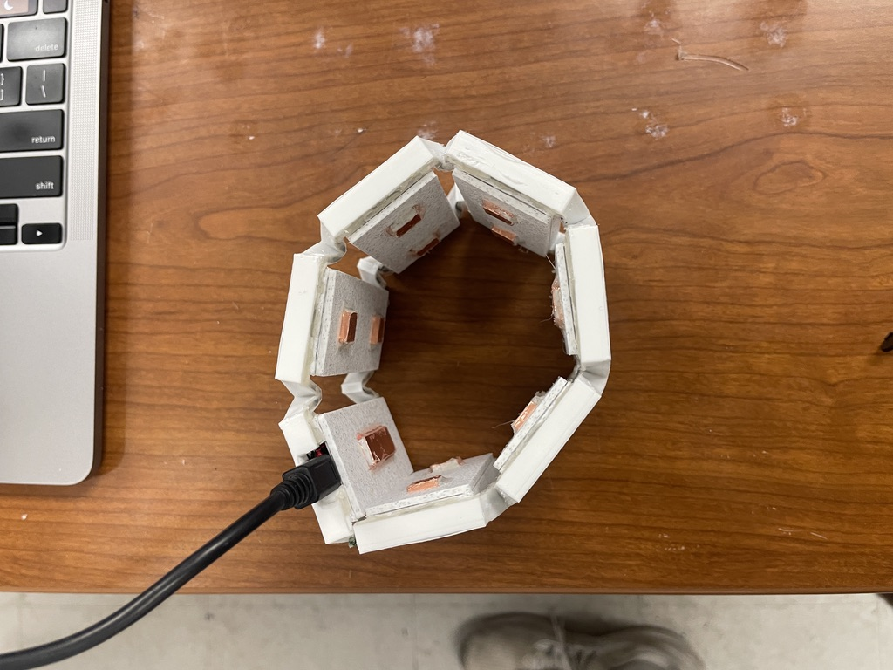
        
Arm-band Inside View

    </figure>

    
    <figure>
        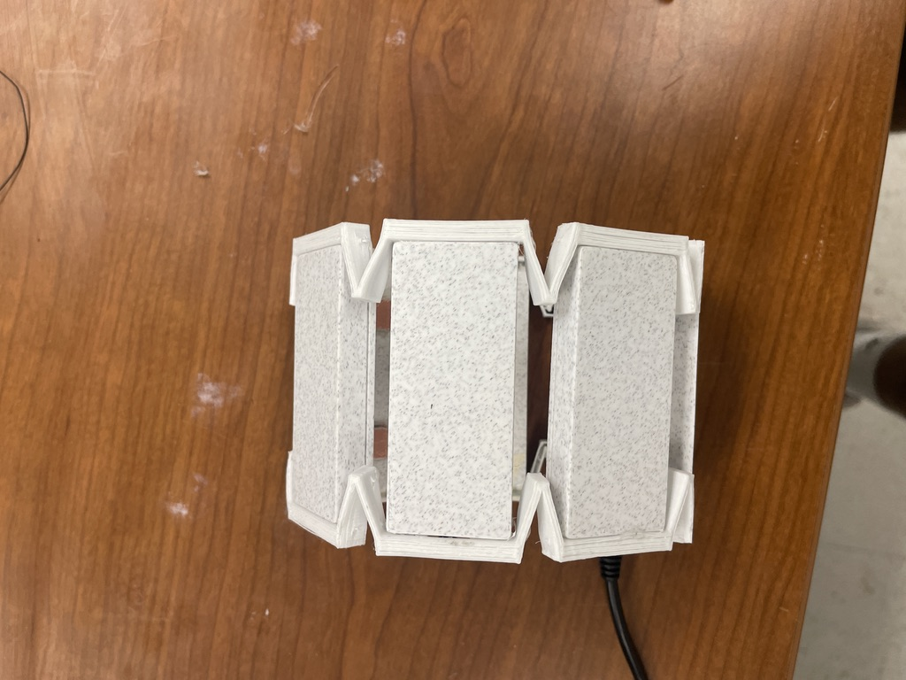
        
Arm-band Side View

    </figure>

    
    <figure>
        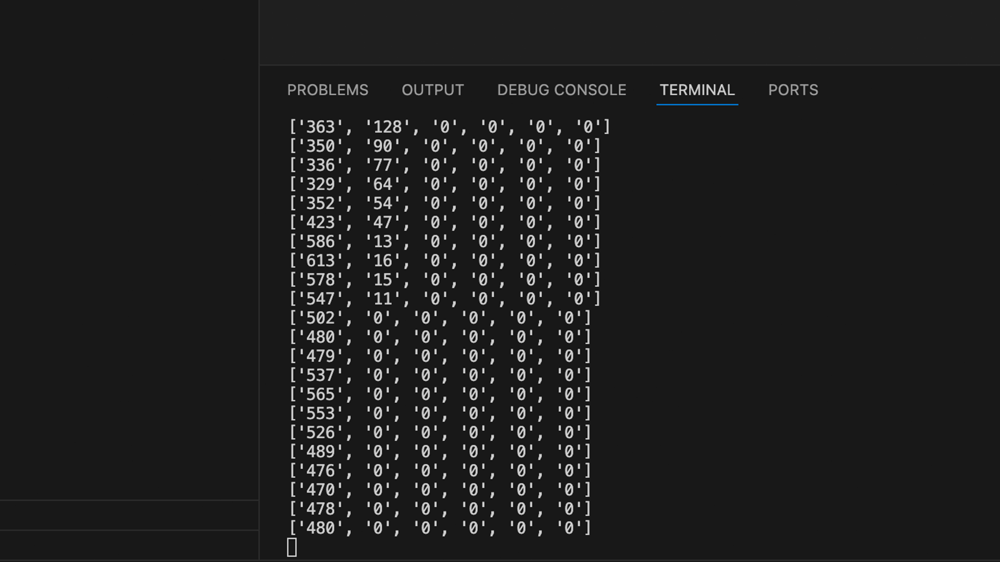
        
EMG Readings

    </figure>

    
    <figure>
        
        
Device Bluetooth Connection

    </figure>

### Cost
| Category | Cost (USD) | Notes |
| ----------- | ----------- | ----------- |
| Electronic Componenets | $20.16 | From DigiKey |
| PCB's | $15.00 | From JLC PCB |
| 3D Printer Filament (16g TPU & 66g PLA) | $1.99 | From BambuLab |

### Time
The time frame for this project was ~ 5 weeks.

| Phase | Time |
| ----------- | ----------- |
| Research | 10 hours |
| Planning | 5 hours |
| Prototyping | 30 hours |
| Testing | 7 hours |

## Conclusion
The ArmSense project successfully met its goals, creating a functional sEMG-based arm band. Future work includes improving sensor noise isolation, enhancing Bluetooth communication, and developing a machine learning model for real-time hand movement prediction, which could benefit disabled individuals lacking hand functionality.

